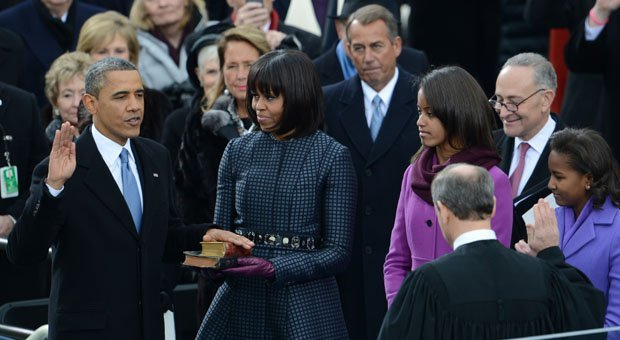

# Ollama llama3.2-vision Tests

This document provides a guide to reproducing the tests conducted with the `llama3.2-vision` model from [Ollama](https://ollama.com/). The tests involve extracting information and analyzing images using Python scripts.

## Prerequisites

Before running the tests, ensure you have installed the required software:

1. **Install Ollama**: Follow the instructions on the [Ollama website](https://ollama.com/).
2. **Install Python Module**: Use the command below to install the necessary Python package `pip install ollama`


## Overview of Tests

The tests are structured as Python scripts paired with corresponding images. Below is a summary of each script and its purpose:

### 1. `artwork.py`
- **Purpose**: Extracts text from an image (`artwork.jpg`) and outputs it in JSON format.
- **Usage**: Ensures the model can handle French and Belgian text extraction.

```
model='llama3.2-vision' created_at='2024-12-30T17:14:45.6742758Z' done=True done_reason='stop' total_duration=86860893200 load_duration=10318791700 prompt_eval_count=33 prompt_eval_duration=6904000000 eval_count=211 eval_duration=69569000000 message=Message(role='assistant', content='Bien sûr, voici le texte extrait dans un format json :\n\n```\n[\n  {\n    "FR": "au saumon et aux carottes met zalm en worteltjes",\n    "BE": "Composition: viandes et sous-produits animaux (34%, naturel* 94%), poissons et sous-produits de poissons (naturel*)"\n  },\n  {\n    "FR": "100%; dont saumon 4% dans les bouchées**), céréales, légumes (dont carottes déshydratées 0.6% (équivalent à des carottes 4%)), substances minérales (0.6%), extraits de protéines végétales, huiles et graisses (dont huile de tournesol 0.1%). **ingrédients naturels.",\n    "BE": "**bouchées représentant environ 43% de la totalité du produit."\n  }\n]\n```', images=None, tool_calls=None)
```

... or in a more readble way:

```json

[
  {
    "FR": "au saumon et aux carottes met zalm en worteltjes",
    "BE": "Composition: viandes et sous-produits animaux (34%, naturel* 94%), poissons et sous-produits de poissons (naturel*)"
  },
  {
    "FR": "100%; dont saumon 4% dans les bouchées**), céréales, légumes (dont carottes déshydratées 0.6% (équivalent à des carottes 4%)), substances minérales (0.6%), extraits de protéines végétales, huiles et graisses (dont huile de tournesol 0.1%). **ingrédients naturels.",
    "BE": "**bouchées représentant environ 43% de la totalité du produit."
  }
]
```

### 2. `coca.py`
- **Purpose**: Extracts text from an image (`coca.jpg`) and outputs it in JSON format.
- **Usage**: Tests the model's ability to detect English text with spatial annotations.

```
model='llama3.2-vision' created_at='2024-12-30T16:21:01.0323665Z' done=True done_reason='stop' total_duration=40449686000 load_duration=19181300 prompt_eval_count=26 prompt_eval_duration=2078000000 eval_count=110 eval_duration=38087000000 message=Message(role='assistant', content='Sure, here is the text from the image:\n\n[\n  {\n    "text": "Can\'t Beat The Real Thing.",\n    "y": 0.263,\n    "x": 0.273\n  },\n  {\n    "text": "CLASSIC",\n    "y": 0.541,\n    "x": 0.511\n  },\n  {\n    "text": "Enjoy Coca-Cola CLASSIC",\n    "y": 0.841,\n    "x": 0.855\n  }\n]', images=None, tool_calls=None)
```

### 3. `heater.py`
- **Purpose**: Identifies the illuminated LED color from a set of images (`OK0.jpg`, `OK1.jpg`, `KO0.jpg`, `KO1.jpg`, `KO2.jpg`).
- **Usage**: Demonstrates how the model handles repetitive tasks and extracts minimal information (e.g., "green," "red").

```
Testing image : OK0
model='llama3.2-vision' message=Message(role='assistant', content='OK.', images=None, tool_calls=None)

Testing image : OK1
model='llama3.2-vision' message=Message(role='assistant', content='OK.', images=None, tool_calls=None)

Testing image : KO0
model='llama3.2-vision' message=Message(role='assistant', content='KO.', images=None, tool_calls=None)

Testing image : KO1
model='llama3.2-vision' message=Message(role='assistant', content='OK.', images=None, tool_calls=None)

Testing image : KO2
model='llama3.2-vision' message=Message(role='assistant', content='OK.', images=None, tool_calls=None)
```

### 4. `peugeot205.py`
- **Purpose**: Determines the model and year of the car in an image (`peugeot205.jpg`).
- **Usage**: Tests the model's ability to recognize objects and infer contextual information.

### 5. `vision.py`
- **Purpose**: Provides a detailed description of the content of an image (`image.jpg`).
- **Usage**: Evaluates the model's ability to produce descriptive, contextual image analyses.



```
model='llama3.2-vision' created_at='2024-12-30T16:19:28.3660872Z' done=True done_reason='stop' total_duration=122799387400 load_duration=17172500 prompt_eval_count=18 prompt_eval_duration=5183000000 eval_count=326 eval_duration=117478000000 message=Message(role='assistant', content="The image shows a photograph of Barack Obama's swearing-in ceremony as the 44th President of the United States. The image is taken from behind, and it shows Michelle Obama standing next to him.\n\nIn the foreground, there are several people visible. On the left side of the image, there is a woman in a purple coat with her back turned towards the camera. She appears to be taking a photo or video of the ceremony using her phone. Next to her is a man in a black suit and tie, who seems to be observing the proceedings.\n\nIn the center of the image, Barack Obama stands tall, his right hand raised in a solemn gesture as he takes the oath of office. He wears a dark blue suit with a white shirt and a light blue tie. His left hand rests on a Bible, which is held by someone out of frame to the right.\n\nTo Obama's left, Michelle Obama stands proudly beside him, her eyes fixed intently on the proceedings. She wears a navy blue coat dress with a patterned design and matching gloves. Her hair is styled in a sleek bob, and she carries herself with poise and confidence.\n\nBehind them, a crowd of people can be seen gathered around the stage or podium where the ceremony is taking place. They appear to be dignitaries, politicians, or other officials who have come to witness this historic moment. Some of them are smiling or applauding, while others look more serious or contemplative.\n\nOverall, the image captures a powerful and emotional moment in American history, as Barack Obama begins his presidency with a sense of hope and optimism for the future.", images=None, tool_calls=None)
```

... or in a more readable way:

> The image shows a photograph of Barack Obama's swearing-in ceremony as the 44th President of the United States. The image is taken from behind, and it shows Michelle Obama standing next to him.
>
> In the foreground, there are several people visible. On the left side of the image, there is a woman in a purple coat with her back turned towards the camera. She appears to be taking a photo or video of the ceremony using her phone. Next to her is a man in a black suit and tie, who seems to be observing the proceedings.
>
> In the center of the image, Barack Obama stands tall, his right hand raised in a solemn gesture as he takes the oath of office. He wears a dark blue suit with a white shirt and a light blue tie. His left hand rests on a Bible, which is held by someone out of frame to the right.
>
> To Obama's left, Michelle Obama stands proudly beside him, her eyes fixed intently on the proceedings. She wears a navy blue coat dress with a patterned design and matching gloves. Her hair is styled in a sleek bob, and she carries herself with poise and confidence.
> 
> Behind them, a crowd of people can be seen gathered around the stage or podium where the ceremony is taking place. They appear to be dignitaries, politicians, or other officials who have come to witness this historic moment. Some of them are smiling or applauding, while others look more serious or contemplative.
> 
> Overall, the image captures a powerful and emotional moment in American history, as Barack Obama begins his presidency with a sense of hope and optimism for the future.

## Running the Tests

1. Locate the respective script (`.py`) and make sure the images (`.jpg`) are found in the `img/` directory.
2. Execute the script using Python: `python vision.py`

## Notes

- The Ollama platform and `llama3.2-vision` model must be installed and running locally for the scripts to work.
- Ensure all image files are correctly named and available in the directory.

Happy testing!


